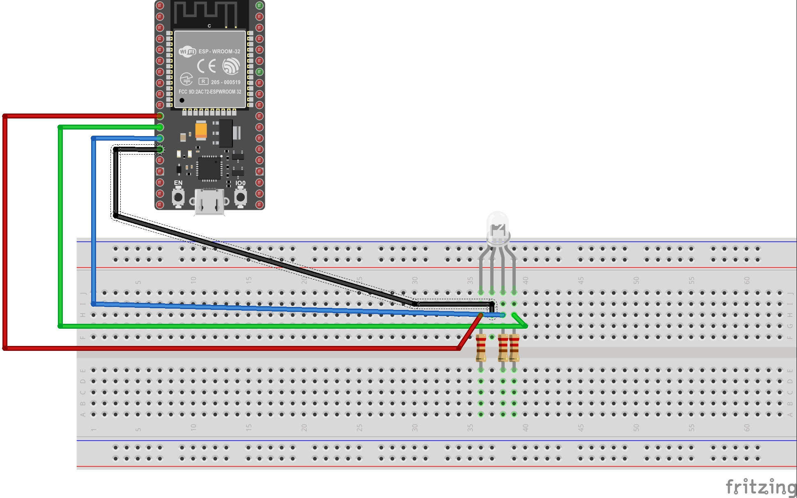

# Led-RGB-ESP32-avec-Node-Red

Allumer à distance une led rgb en choisissant la couleur via l'interface Node Red.

## Video

cliquer sur la photo pour voir la video

# Photo du montage

# Bibliothèque a utiliser

include <Adafruit_MQTT.h>

include <Adafruit_MQTT_Client.h>

include <WiFi.h>

include <analogWrite.h>

# Liste des composants

+ 1 ESP32
+ 1 Led RGB
+ 1 Bread Board
+ 1 Cable usb 
+ 3 resistances 220 Ω
+ 4 cables male/femelle
